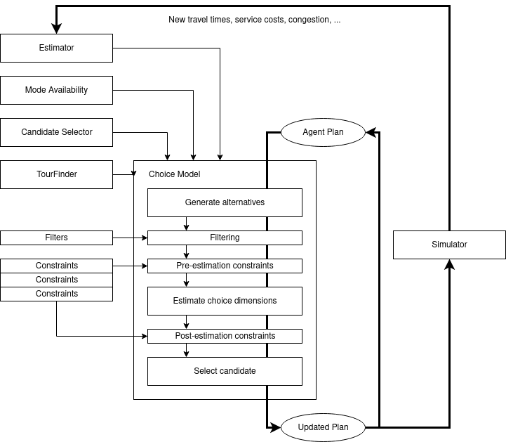

# Getting Started

There are some tools included in the DMC component that make it easy to get started right away. The following sections are a first primer on how to use the extension. Step by step its features will be introduced. Some prior knowledge on how to work with MATSim form code will be needed. Some guidelines on how to use MATSim can be found [here](https://matsim.org/docs/tutorials/general).

## Setting up an example

All examples in this Getting Started guide will be based on a simple Sioux Falls scenario, which is packaged in the MATSim repository. It can be used by adding `org.matsim.matsim-examples` as a dependency in the `pom.xml`. Then, a simple run script looks like this:

```java
public class RunRandomSelection {
	static public void main(String[] args) {
		URL configURL = IOUtils.newUrl(ExamplesUtils.getTestScenarioURL("siouxfalls-2014"), "config_default.xml");

		Config config = ConfigUtils.loadConfig(configURL);
		config.controler().setOverwriteFileSetting(OverwriteFileSetting.deleteDirectoryIfExists);
		config.controler().setOutputDirectory("output");
		
		Scenario scenario = ScenarioUtils.loadScenario(config);

		Controler controller = new Controler(scenario);
		controller.run();
	}
}
```

Running this script will create the `output` directory and perform some iterations for the Sioux Falls scenario. If you look at the output you will see that agents are making mode choices. 

In the configuration you will see the reason for that: It has the `SubtourModeChoice` strategy enabled, which is commonly used today for mode decisions in MATSim. The way this strategy works is that for each replanning agent a sub-tour of the plan is chosen. A sub tour can be any number of trips that lie between two activities with the same location. Once a sub-tour is chosen, all of the trip modes between the two activities are set to a randomly selected option out of a list of given modes.

The first step of this exercise will be to replicate that behaviour with the DMC extension.

## First run: Random selection

As a first step, the DMC extension can be set up for random selection of modes. This is almost a 1:1 replacement for the `SubtourModeChoice` strategy in MATSim. To get started, the DMC needs to be activated by adding:

```java
controller.addOverridingModule(new DiscreteModeChoiceModule());
```

This adds the module, but does not activate anything. Running the script would result in the exact same behaviour. Additionally, some settings in the configuration must be changed. To get started, DMC provides a helper function. It needs to be called on the `Config` object:

```java
DiscreteModeChoiceConfigurator.configureAsSubtourModeChoiceReplacement(config);
```

This helper can always be used when one has a scenario with `SubtourModeChoice` and wants to get started with a more complex choice model. It replaces the `SubtourModeChoice` replanning module, adds the `DiscreteModeChoiceConfigGroup` if it is not present already in the `Config` object and configures the DMC choice model such that it behaves exactly as `SubtourModeChoice`. The script can be run again now and should produce the same output as before.

The same result can also be achieved not by using the `DiscreteModeChoiceConfigurator` helper, but by configuring DMC via the config file. For that, we can go back to the initial example and add the config group when the file is loaded: 

```java
Config config = ConfigUtils.loadConfig(configURL, new DiscreteModeChoiceConfigGroup());
```

When we now load a config file, the `DiscreteModeChoice` module will be recognized:

```xml
<module name="DiscreteModeChoice">
   <!--- our configuration -->
</module>
```

To set up the model that we just used, the configuration would look like that:

```xml
<module name="DiscreteModeChoice">
   <param name="modelType" value="Tour" />
   <param name="selector" value="Random" />
   <param name="tourConstraints" value="VehicleContinuity,SubtourMode" />
   <param name="tourFinder" value="PlanBased" />
   <param name="tourEstimator" value="Uniform" />
   
   <parameterset type="modeAvailability:Car">
      <param name="availableModes" value="pt, car, walk" />
   </parameterset>
</module>

<module name="strategy">
   <parameterset type="strategysettings">
      <param name="strategyName" value="DiscreteModeChoice" />
      <!-- further settings, weight, etc ... -->
   </parameterset>
</module>
```

So adding this to the config file and running the initial script with `DiscreteModeChoiceConfigGroup` added and `DiscreteModeChoiceModel` registered, again we will arrive at the same result. However, now we gained the ability to configure the choice model as we like. But what exactly did we configure here?

## A little bit of theory

Mainly, a model in the DMC extension consists of a number of components: the [Model](components/Model.md), the [Mode Availability](components/ModeAvailability.md), the [Estimator](components/Estimator.md), the [Selector](components/Selector.md), as well as [Constraints](components/Constraint.md). Tour-based models can additionally be configured with a [TourFinder](components/TourFinder.md). We will go through these components quickly. 



There are two types of base models in DMC: tour-based and trip-based. The replanning of one agent's plan looks as follows:

### 1. Find all trips/tours 
The first step is to find all the relevant choice situations for an agent. In a trip-based model, each trip is a separate choice situation. In a tour-based model the situation is more complicated. Here, the agent is supposed to choose between different *tours*. One tour is by definition a chain of trips. Each trip is defined by an origin and a destination activity for which the desired departure time, locations in the network, etc. are known. After all choice situations are identified an initial selection is taking place. By using [Filter](components/Filters.md) components we can now define whether each choice situation should even be considered for mode choice. At this stage we may exclude tours which are too long (to save run time) or exclude trips and tour which enter or exit a certain analysis region.

### 2. Obtain all modes that the agent can use
This next step is covered by the [Mode Availability](components/ModeAvailability.md) component. Multiple implementations of this stage exist. By setting `modeAvailability` in the configuration above to `Car` we choose the implementation called `Car`. Another implementation would be `Default`, which simply assigns all possible modes to each agent. However, `Car` restricts the use of the "car" mode for agents who have the attribute `carAvailability` set to `never` or who don't have a driver's license (`hasLicense` is set to `false`). But how does this "mode availability component" know which modes are there in the first place? The `Car` (as well as `Default`) implementation needs additional configuration, which in the example above is given in `<parameterset type="modeAvailability:Car">`. There, we define a list of `availableModes`.  

### 3. Construct all possible choices for the agent
Next step in the replanning is to take the set of modes that are available to the agent and construct all possible alternatives for the choice situations. At each stage during an agent's plan any of the available modes can be chosen at this stage. In a tour-based model the situation is more complicated. Here, the agent is supposed to choose between different *tours*. One tour is by definition a chain of trips, i.e. for the case of mode choice a chain of modes. So if there is a tour consisting of three trips and the two modes `pt` and `walk` are available, the full set of choice alternatives is:

```
{ [walk, walk, walk], [walk, walk, pt], [walk, pt, walk], [walk, pt, pt], [pt, walk, walk], ... }
```

Clearly, the longer a tour is, the more alternatives must be generated. This is why internally never the whole set of tours is constructed, but created iteratively. But how do we define a tour? It is defined by a configurable [TourFinder](components/TourFinder). In the configuration above we set `tourFinder` to `PlanBased`, which means that the whole plan of an agent is considered as one long tour. Consequently, we could also say that we have configured a "plan-based" model. It should be noted that in the Sioux Falls example no overly long plans exist. In other situations it may not be feasible to use the `PlanBased` tour finder.

As an alternative we could have chosen the `ActivityBased` tour finder. It would need a little piece of additional configuration (althrough these are the standard values):

```xml
<parameterset type="tourFinder:ActivityBased">
   <param name="activityType" value="home" />
</parameterset>
```

The `ActivityBased` tour finder implementation would then find all `home` activities in an agent's plan and define tours as those trip chains that lie between two `home` activities. This is the recommended configuration.

### 4. Apply structural contraints

Now we have a set of possible trip or tour alternatives, but obviously some of them are not realistic. Therefore, in the third step, some of them get filtered out. This is done by [Constraints](components/Constraint.md). In this case, `tourConstraints` is set to `VehicleContinuity` and `SubtourMode` Only if all of the chosen constraints do not filter out a certain option, it survives to the next stage. 

In the present case, the `VehicleContinuity` constraint is chosen as the first one. It makes sure that vehicles can only be used where they have been moved to before. For that, the constraint implementation makes use of the structural information of the plan, i.e. where all of the activities take place. The constraint can be configured through a `tourConstraint:VehicleContinuity` parameter set, for instance which modes are constrained (`car` and `bike` by default) and if the first trip by those modes is required to start at home or if the last one is required to end there.

The additional `SubtourMode` constraint is added by the `configureAsSubtourModeChoiceReplacement` helper depending on whether the probability to choose a single leg mode in `SubtourModeChoice` is lager than zero. This is a recent addition to the standard `SubtourModeChoice` strategy of MATSim that makes it possible to vary between different non-contrained modes along one unconstrained sub-tour. (More on that in ([Constraints](components/Constraint.md)).

Additional constraints are available by default, e.g. `LinkAttribute`, which only allows to use a certain mode if the origin and/or destination link of the trip has a certain attribute, or `ShapeFile`, which can be configured to only allow trips if they are start and/or end within a certain zone in a shape file. Most of those constraints work on a trip-level, i.e. they don't need information about a whole tour. Adding such a trip-based constraint to the above definition could, for instance, look like this:

```xml
<module name="DiscreteModeChoice">
   <!-- ... -->
   <param name="tripConstraints" value="LinkAttribute,ShapeFile" />
   <param name="tourConstraints" value="VehicleContinuity,FromTripBased" />
   <!-- ... -->
```

The `FromTripBased` tour-based constraint is a special contraint, which looks up all the trip-constraints that are chosen and makes sure that the trip in all of the considered tours fulfill all of them. In case a trip-based base model is used (`modelType == Trip`) no tour constraints are taken into account and the configured `tripConstraints` are applied directly to the trip alternatives.

### 5. Estimate utilities for all alternatives

In the fourth step, an [Estimator](components/Estimator.md) implementation is used to assign a utility value to each of the alternatives. In a tour-based model whatever is configured as the `tourEstimator` is used, while trip-based models refer to the `tripEstimator` option. 

The example above chooses the tour estimator `Uniform`. This estimator simply assigns a `0` utility to all alternatives. Since we want to perform a random choice of alternatives, we do not bother calculating anything fancy here. However, more complex estimators can look at the single trips and estimate, for instance, travel times, waiting times for taxi trips, line switches for public transit connections, and so on (more on that later) and assign utilities to these choice inputs. 

Again, often one would like to create a tour-based model, but in terms of utility the alternatives are merely independent. In that case the tour *estimator* `Cumulative` can be used, which will estimate every trip independently with whatever is defined as the `tripEstimator` and sum up the trip utilities.

### 6. Apply choice constraints

In the fifth step, the constraints come back into play again. Each constraint defines one filter *before* estimation (as discussed above) and one *after* estimation. At this point additional information, mainly from the routing, is available. Based on this information further alternatives can be filtered out at this stage. In this case, the `VehicleContunuity` constraint does not perform any checks after estimation.

### 7. Select one alternative

The last step in the process is choice selection. For that purpose, multiple impementations of [Selectors](components/Selector.md) exist. These take into account all remaining choice alternatives and their utilities and return one out of them. In this case, the `Random` selector has been chosen, which does what the name says: It simply returns one random alternative from the given set. 

More complex models can, for instance, use the `MaximumUtility` selector, which always returns the choice alternative with the highest utility. Another alternative is the `MultinomialLogit` selector, which derives a utility-based probability distribution over all alternatives and samples one of them.

### 8. BYOC (Bring you own component)

While there is a number of standard implementations for [Mode Availability](components/ModeAvailability.md), [Estimator](components/Estimator.md), [Selector](components/Selector.md), [Constraints](components/Constraint.md) and [TourFinder](components/TourFinder), the DMC framework makes it easy to create one's own components. For further information, please have a look at [Customizing the framework](Customizing.md) or the respective chapters.

For now, we continue with the Getting Started guide and use the information we just got to construct a bit more interesting models than a random selection.

## An importance sampling model

In order to let agents make more intelligent decisions, we first need to give them the ability to compare alternatives. For that, an estimator needs to be implemented or chosen. There is one standard implementation (called `MATSimDayScoring`), which assigns utilities to all *trips* (no activities) the same way the standard MATSim scoring function would score them:

```xml
<param name="tourEstimator" value="MATSimDayScoring" />
```

This estimator uses the internal MATSim `TripRouter` to route all trips in all of the tour alternatives (in an intelligent caching way) and applies the same factors as the MATSim scoring function to the choice dimensions (e.g. travel time, distance, etc.). This way, the estimator produces (approximately) the same results as the MATSim scoring function. Note that activities are not considered here. Still, using this estimator we get a better idea of which alternatives are good and which ones are not.

However, this does not bring any benefit as long as the selection of alternatives is still random. Therefore, we also need to switch this:

```xml
<param name="selector" value="MultinomialLogit" />
```

This applies the multinomial logit selection to the utilities, i.e. each alternative *i* gets assigned a probability according to:

```
P(i) = exp( U_i ) / Sum( exp( U_1 ) + exp( U_2 ) + ... + exp( U_n ) )
```

Then, one alternative is sampled according to this distribution. What happens now is that alternatives with high estimated utility will be chosen more frequently. Those are also the ones, which are more likely to be accepted by the standard replanning process in MATSim. Remember, plans with high utility are preferred and after each plan innovation the worst-utility plan in an agent's memory gets deleted. This way, instead of sampling random plans, we help the MATSim selection process by sampling relevant alternatives. In fact, we have constructed an importance sampler for promising plans. It becomes very unlikely now that MATSim needs to test a plan that contains a trip of 50km walking. 

Also note that no alternative has a probability of exactly zero. The worst that can happen now is that we underestimate the attractivity of certain plans. In that case, MATSim will encounter them less frequently (and after a larger number of iterations than usual) and convergence will be slowed down. However, a well-structured utility estimator is very unlikely to perform worse than a purely random sampling. In any case, since all alternatives have non-zero probability, MATSim should be able to converge to the same state as in the random sampling, just in (likely shorter) time.

The DMC choice as an important sampler can also be configured using

```java
DiscreteModeChoiceConfigurator.configureAsImportanceSampler(config);
```

## An only-mode-choice implementation

Sometimes, we are not interested in things such as activity scheduling. If we perform a bare mode choice experiment with MATSim, we now have the possibility to skip the evolutionary selection model in MATSim. Instead, we can feed the choices from the choice model directly to the replanning agents. In that case we can even define new specific utility estimator. The framework makes this easy, as in this example:

```java
public class MyTripEstimator extends AbstractTripRouterEstimator {
	@Inject
	public MyTripEstimator(TripRouter tripRouter, Network network, ActivityFacilities facilities) {
		super(tripRouter, network, facilities);
	}

	@Override
	protected double estimateTrip(Person person, String mode, DiscreteModeChoiceTrip trip,
			List<TripCandidate> previousTrips, List<? extends PlanElement> routedTrip) {
		// I) Calculate total travel time
		double totalTravelTime = 0.0;
		double totalTravelDistance = 0.0;

		for (PlanElement element : routedTrip) {
			if (element instanceof Leg) {
				Leg leg = (Leg) element;
				totalTravelTime += leg.getTravelTime() / 3600.0;
				totalTravelDistance += leg.getRoute().getDistance() * 1e-3;
			}
		}

		// II) Compute mode-specific utility
		double utility = 0;

		switch (mode) {
		case TransportMode.car:
			utility = -0.5 - 0.025 * totalTravelDistance;
			break;
		case TransportMode.pt:
			utility = -0.15 - 0.15 * totalTravelTime;
			break;
		case TransportMode.walk:
			utility = -1.0 * totalTravelTime;
			break;
		}

		return utility;
	}
}
```

Here we make use of the `AbstractTripRoutedEstimator` class, which already performs most of the programming for us that gives us a routed trip. The only thing we have to do is implement the `estimateTrip` method. In this case, we simply sum up all the travel times on the trip and weight it with a factor depending on the mode. Clearly, in terms of utility spending time walking is least attractive in this utility function, while the same time in public transport is considered better.

To make use of the new estimator, we need to register it. For that, we can create a custom extension, which is a simple `AbstractModule` from MATSim, but with some additional functionality for convenience:

```java
public class MyDMCExtension extends AbstractDiscreteModeChoiceExtension {
   @Override
   public void installExtension() {
      bindTripEstimator("MyEstimatorName").to(MyTripEstimator.class);
   }
}

// ...

controller.addOverridingModule(new MyDMCExtenson());
```

The new estimator implementation is now registered with the name `MyEstimatorName`. Since it is a trip estimator, but we want to use it on a tour level, we can make use of the `Cumulative` tour estimator:

```xml
<param name="tripEstimator" value="MyEstimatorName" />
<param name="tourEstimator" value="Cumulative" />
```

Now the utility of one tour gets calculated by summing up all the utilities of the trips, which are returned by `MyTripEstimator`. It is now perfectly possible to run this utility function with the setup as above using a multinomial logit selection. Unfortunately, if these parameters don't fit well with what MATSim uses in the scoring of the the Sioux Falls scenario we will create misleading solutions.

However, the plan is to use the model directly in that case, i.e. whenever an agent is replanned, we simply assign the result of the mode choice and we make sure that the agent keeps only one plan. This way, no scoring or selection in MATSim is even necessary. We achieve this by setting a couple of configuration options:

- `DiscreteModeChoice` should be the only innovation module
- For selection in MATSim the `KeepLastSelected` strategy from main MATSim should be used

This will make sure, that during replanning either no change is made to the current plan of the agent, or it is replanned in `DiscreteModeChoice`.

- The plan memory size should be set to `1`
- `NonSelectedPlanSelector` should be set as the removal strategy

This makes sure that as soon as there is more than one plan (i.e. after `DiscreteModeChoice` has been performed) the *not selected* plan is removed (which is the one from before the replanning). Thus, we keep the plan that has just been generated.

In consequence, what will happen is follows:

1. MATSim performs the network simulation with all agents
2. MATSim calls `DiscreteModeChoice` for a fraction of agents, all others keep their current plan
3. MATSim performs the network simulation with the new choices, and so on

Such a setup allows us to test discrete choice models as they are measured from survey data or similar directly in MATSim. Effectively, we have a mode choice model, which runs in a loop with the network simulation. Hence, we call this "mode choice in the loop". There is a shortcut to apply all of those configuration options in one go:

```java
DiscreteModeChoiceConfigurator.configureAsModeChoiceInTheLoop(config);
```

## Frozen randomness

With the knowledge we have obtained by now, we can get a bit creative. One interesting concept in discrete choices is "frozen randomness". A simple multinomial logit model can be phrased as a maximum selection problem for a single choice:

```
u_choice = max { u_1, ..., u_N } ; with u_i = v_i + e_i
```

So here we choose the alternative with the maximum utility form a set of options. However, the utilities of those options are composed of a deterministic term `v_i`, which would represent our utility function as we have defined it previously. The other component is `e_i`, which is a random error component. It can be shown mathematically that if `e_i` is chosen to be following an extreme value distribution, the probability of observing a certain alternative `u_i` is exactly the same in the formulation here and further above (the equation with the exponential terms). So if we would just repeatedly evaluate the expression here with ever changing error values and count how many times we see a certain alternative, we arrive at the same fractions as if we would have calculated the probabilities above.

Now performing a random selection in a simulation like MATSim is not ideal in some cases. Imaging a situation where there are two alternatives (car and public transport), but their utilities are almost equal. Looking at the choice probability, we arrive at:

```
P(car) = exp(u_car) / ( exp(u_car) + exp(u_pt)) ; with u_car == u_pt
```

Then, it is easy to see that we have a probability of `0.5` for both alternatives. This means that if an agent replans a certain trip in two consecutive iterations, the choice will once be `car` and once `pt`. In fact, it is quite likely that the agent will frequently switch back and forth between the two modes, even if the surrounding transport system is merely equilibrated.

One option to overcome this problem is to introduce "frozen randomness". As we've seen there is always an error component, explicitly or implicitly, included in our choice model. But what if we say that these errors are not sampled on a case-by-case basis, but for a combination of agent, trip and mode it always stays the same? In that case we erase the variability on the agent level. If we arrive at such a 50%/50% situation there will always be one alternative that is dominant because we have a fixed error term. On the macroscopic level (e.g. looking at overall mode share), however, we will still see the same values as before under the condition that the fixed ("frozen") error terms have been sampled according to the correct distribution.

With the tools that we've seen so far it is easy to set such a "frozen randomness choice" up. The ingredients we need are:

- An estimator that figures out a fixed error term for the alternative at hand and adds it to the utility
- A maximum utility selection (which will now be affected by the frozen error)

We've seen already that we can set up both components easily using the Discrete Mode Choice extension.

### A frozen randomness estimator

We can go back to the `MyTripEstimator` example. We can simply get the frozen error term from the activity attributes in the agents' plans. This probably not the most efficient way of implementing frozen randomness, but it will demonstrate the point. We can extend the utility calculation as follows:

```java
utility += (Double) trip.getOriginActivity().getAttributes().getAttribute("next_error_" + mode);
```

We simply read the error from the attributes of the preceeding activity. If we estimate a utility for "car", we will look up the attribute "next_error_car", if we estimate an utility for "pt", we will look up the attribute "next_error_pt".

### Maximum utility selector

To enable the maximum utility selection, we simply need to change the config file:

```xml
<param name="selector" value="Maximum" />
```

### Frozen randomness generator

Finally, we need to generate the error terms. For that, we can add code to the main method of the simulation, after the scenario is loaded (i.e. after `ScenarioUtils.loadScenario(...)`). The code could look somewhat like this:

```java
// Initialize a random number generator
Random random = new Random(0);
List<String> modes = Arrays.asList("car", "pt", "walk");

for (Person person : scenario.getPopulation().getPersons().values()) {
	for (PlanElement element : person.getSelectedPlan().getPlanElements()) {
		if (element instanceof Activity) {
			// Go through all activities of all agents
			Activity activity = (Activity) element;

			for (String mode : modes) {
				// Sample an extreme value (Gumbel) error term
				// (see https://en.wikipedia.org/wiki/Gumbel_distribution)
				double uniformError = random.nextDouble();
				double gumbelError = -Math.log(-Math.log(uniformError));
				
				activity.getAttributes().putAttribute("next_error_" + mode, gumbelError);
			}
		}
	}
}
```

## Conclusion

This short Getting Started guide should give a short overview of the functionality of the Discrete Mode Choice extension. To summarize, there are three important things, that work out of the box:

- A fully functional SubtourModeChoice replacement, which allows for a flexible and individual definition of additional constraints (such as operating areas)
- An importance sampling configuration that is able to speed up convergence in MATSim (for standard utility functions)
- A mode-choice-in-the-loop configuration which turn MATSim into an iterative process between network simulation and a discrete mode choice model

Finally, with the example of "frozen randomness" you could get a glimpse of other applications of the extension. We're looking forward to seeing your projects work with DMC.
