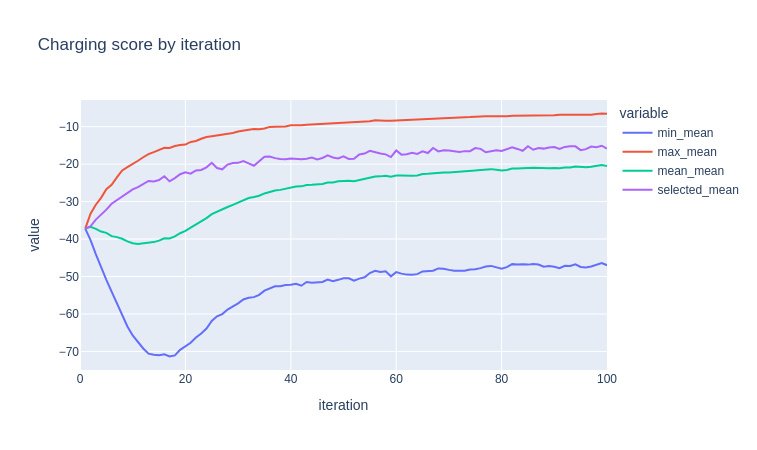
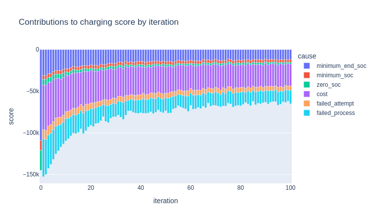
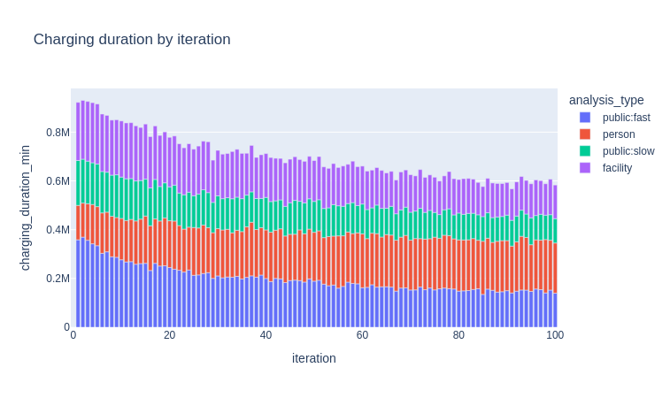
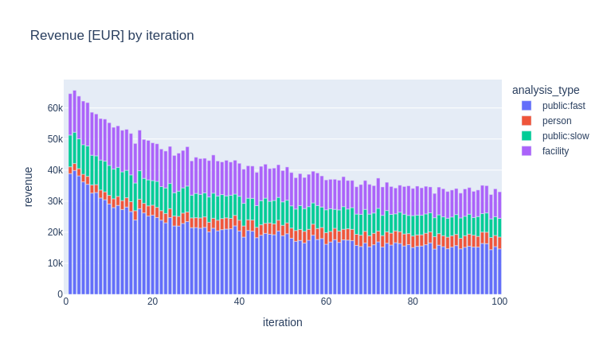

# EV: Electric Vehicle functionality for MATSim

## Strategic electric vehicle charging (SEVC)

This PR introduces two major packages into the `ev` contrib:

- *Within-day electric vehicle charging (WEVC)* provides a comprehensive framework for letting MATSim agents charge during the simulation. On the one hand, it allows users to implement planned charging activities into the schedules at the beginning of the day, on the other hand, it allows to define a custom logic regarding how agents change their plans during the day, receact to occupied chargers, etc. The package is meant as a backing package that required substantial code-based configuration.

- *Strategic electric vehicle charging (SEVC)* provides high-level functionality for simulating rich charging behavior of agents. It adds a second replanning layer (with dedicated *charging plans*) on top of MATSim's standard replanning, which optimizes charging decisions (when, where, ...) in an evolutionary way. Charging plans are scored like regular MATSim plans, reacting to zero SoC events, minimum reached SoCs, charging costs, and other components. The package provides rich functionality to analyze in detail the scoring components, define access rules (subscriptions) between persons and chargers, and detailed tariffs for chargers. 

### WEVC: Within-day electric vehicle charging

The core of WEVC is the `WithinDayEvEngine` which manages the charging behavior of agents. The system is based on the concept of *charging slots*. There are *activity-based* charging slots and *leg-based* charging slots. An *activity-based* charging slot is defined by a sequence of (main) activities during which the agent intends to charge. The engine will make sure that the agent drives to the selected charger before starting the first main activity in the sequence, then walks to the main activity, performs the sequence of (or only one) main activities, walks back to the charger, and picks up the vehicle again. The *leg-based* charging slots divert the initially planned leg such that a period of charging is inserted during a specified period.

Internally, *WEVC* works by rewriting the within-day agent plan at specific moments during the simulation. At start-up, all planned charging activities are inserted by the means of a *plug* activities to which the engine responds later on. During such an activity, the engine makes the agent try plug his vehicle. If this succeeds the plan is further rewritten to represent the logic above. For an activity-based charging slot, the return journey to the charger is inserted after the last main activity of the sequence, including an *unplug* activity. During that activity, the agent unplugs the vehicle from the charger and then continues the journey. For leg-based charging slots, the agent enters a *wait* activity after the *plug* activity for a predefined duration and then performs the *unplug*, followed by another diversion to the next main activity.

On top of the planned charging activities, *WEVC* allows to define online behaviors. They define what happens in several cases:

- If a certain queue time is passed at a charger without success, the agent will attempt to charge elsewhere. The engien then makes sure that the *plug* activity is ended, and a new one at dynamically chosen charger is inserted.
- If an agent goes on a leg that leads to / contains a charging slot, an online decision can be made. This is useful, for instance, for simulation behaviors in which the agent checks charger availability on a map and updates his initial choice of charger.
- Optionally (since more time consuming), *spntaneous charging* can be enabled which will allow an agent to dynamically decide when starting any *vehicle leg* whether the agent wants to charge along that leg or not.

Code-wise *WEVC* is based on two main interfaces that need to be implemented:

- The `ChargingSlotProvider` is used to obtain a list of planned charging slots at the beginning of a simulated day. A `ChargingSlot` consists of a *start activity*, an *end activity*, and a *charger* for activity-based charging, and a *leg*, a *charger*, and a *duration* for leg-based charging. 

- The `ChargingAlternativeProvider` is used for any dynamic decision. In the default case, it provides a new *charger* given a `ChargingSlot`. When updating a leg-based charging slot, also a new duration can be given. For every decision, the trace of all previously visited alternatives in the current search process is given to avoid visiting two chargers twice. For activity-based charging slots *enroute* decisions can be made when approaching the first main activity. In that case, providing a *duration* can also transform an initially activity-based slot into a leg-based charging activity.

**Events**

When following the life cycle of the charging agents, they generate `StartChargingProcessEvent`s when they start a search process. Inside each charging process, multiple `StartChargingAttemptEvent`s can be observed with each *attempt* representing one try to make use of a charger. An *attempt* can either fail which is indicated by a `AbortChargingAttemptEvent`. At that point, either a new decision is made using the `ChargingAlternativeProvider` and a new *attempt* will start, or a `AbortChargingProcessEvent` is raised. In that case, *WEVC* can be configured to let the agent get *stuck* or simply follow the daily plan. In case an online decision is made when approaching a charging slot before the first *attempt*, an `UpdateChargingAttemptEvent` is generate to document the change. A standard event sequence (including the standard `ev` events) is, hence:

```
StartChargingProcessEvent > StartChargingAttemptEvent > ChargingStartEvent > ChargingEndEvent > EndChargingAttemptEvent > EndChargingProcessEvent
```

**Analysis**

*WEVC* provides some standard *CSV* analysis output that tracks all the charging processes and attempts in detail (start time, queue time, plug time, charged energy, ...). Furthermore, it is thoroughly tested with ~25 unit tests covering the different scheduling situations that can arise.

**Usage**

To use *WEVC*, the `WithinDayEvModule` needs to be added to the controler. It must be configured using the `WithinDayEvConfigGroup`, which allows, for instance, to choose the mode that is covered by the charging logic. Furthermore, every agent that is supposed to take part in witin-day event charging needs be activated by setting the `wevc:active` attribute to `true`. Some convenience functions are provided in `WithinDayEvUtls` that allow to easily set up a scenario, in particular `WithinDayEvUtils.activate(Person)`.

When implementing `ChargingSlotProvider` and `ChargingAlternativeProvider`, it is advise to make use of `ChargingSlotFinder`, which is a convenience class that allows to identify all viable activity-based and leg-based charging slots along an agent's plan. A viable activity-based charging slot is any sequence of main activities with a leading and following vehicular leg (or start/end of day) that does not contain an intermediate vehicular leg. A viable leg-based charging slot is any vehicular leg. Note that both types may conflict, so `ChargingSlotFinder` also provides the functionaltiy to remove items of either type from a list of slot candidates, given on a set of already selected candidates from the other type. Various examples are given in in the unit tests. An example will be provided in *matsim-code-examples*.

### SEVC: Strategic electric vehicle charging

The purpose of *SEVC* is to provide an easy-to-use and feature-rich package for simulating the charging behavior of the population. The focus lies on different charger types and on exploring how and when persons would use those chargers.

*SEVC* is based on the concept of *charging plans*. Each regular MATSim plan of a *WEVC*-enabled agent contains a memory of such *charging plans*. As in regular MATSim replanning, charging plans can be selected from memory and innovated. For instance, the standard innovation approach in *SEVC* is to randomly select charging slots along the plan of an agent using the `ChargingSlotFinder` and then finding viable chargers (see below). The selection part is handled, as in regular MATSim, on the basis of a *charging score* that is applied to each *charging plan*. The standard selection strategy for the charging plans is a logit-style approach like it is mostly common in regular MATSim. Technically, the selection and innovation of charging plans is triggered by executing the `StrategicChargingReplanningStrategy` that is implemented as a standard replanning strategy of MATSim. 

A charging plan describes the slots that, at some point in time, were used by the agent. For instance, activity-based charging slots are described by indices over the main activities. The `ChargingSlotProvider` of *SEVC* then examines the saved charging slots of the selected charging plan and compares them to the viable slots of the current main plan (in which modes may have changed due to mode choice and other strategies meanwhile). So if a recorded charging slot is still valid for the current plan configuration, it is implemented in the beginning of the day.

During the simulation, everything that has to do with charging is scored separately from the regular scoring to establish a *charging score* for the selected *charging plan*. This scroring (see below for the individual components) penalizes reaching zero SoC, reaching a minimal SoC, and other events.

Furthermore, *SEVC* defines a standardized `ChargingAlternativeProvider` which provides alternative chargers if the planned one is already occupied. In particular, different overall planning scenarios can be defined via configuration, which (1) let agents go and queue at charger naively with a maximum queue time, (2) check occupancy in an anticipatory way, or (3) resere the initial (or an alternative) charger when approaching the planned charging activity.

**Charger selection**

When constructing new *charging plan*s, the default approach randomly selects viable charging slot candidates (activity-based and leg-based). For each candidate, a charger needs to be selected. This task is handled by a list of `ChargerProvider`s in *SEVC*. All providers try to find chargers that are close enough to the planned activity/leg and fulfill certain other criteria. For performance reasons, it does not make sense to always test all chargers in the vicinity of every agent. Additionally, it may make sense to only propose specific chargers in certain situations. By default, chargers are provided simultaneously by three strategies in *SEVC*:

- *Person* chargers are assigned to a specific list of persons. This means, that they are only proposed when a charger for a specific person (by ID) is searched and if the charger is close enough to the search location. Technically, relevant chargers should have the `sevc:persons` attribute, which can also be set using `StrategicChargingUtils.setChargerPersons()`.
- *Facility* chargers are assigned to a spefici list of facilities. Whenever a charger is searched, the provider will examine the facility of the start activity of the slot and check whether there are chargers that have been assigned to that facility. This allows, for instance, to define chargers that belong to a specific workplace or supermarket. The relevant chargers should have the `sevc:facilities` attribute, which can also be set using `StrategicChargingUtils.setChargerFacilities`.
- *Public* chargers are the most general chargers that are considered by *SEVC*. They are queried using a spatial index based on the search location. They are identified by having their charger attribute `sevc:public` set to `true`.

**Charger access**

*SEVC* provides flexible interfaces to control in detail the access of individual persons to chargers. The default implementation makes use of *subscriptions*. Each charger can have none, one or multiple required subscriptions. Analogously, persons can have a list of available subscriptions. While chargers without required subscriptions are avaialble to all agents, only agents that have the right subscription are allowed at those chargers that required them.

Subscriptions are managed per-person and per-charger using the `sevc:subscriptions` attributes, which can also conveniently be set using the respective helper methods in `StrategicChargingUtils`.

**Charging costs and tariffs**

*SEVC* provides various ways of defining charging costs that can be set up using configuration. Charging costs can be set (1) globally by defining per-kWh, per-minute, per-use costs, (2) in an attribute-based way per charger, or (3) using a detailed tariff system.

When working with the tariff-based cost calculator, the framework user defines a list of named tariffs with specific cost structures (kWh, minutes, ...) in configuration. Each charger then needs to have a list of tariffs defined through their `sevc:tariffs` attribute. Each tariff can also be restricted to a list of subscriptions. Whenever an agent uses a charger, the cost calculator then identifies the tariffs that are available to that person and selects the best.

**Scoring**

The charging score tracks various events and observations during a simulation. Via configuration, their individual contribution to the overall charging score can be configured and a detailed analysis covering all scoring components is generated in CSV format. The components are the following:

- Reaching zero SoC
- Reaching a minimum SoC defined as a per-agent attribute
- Observing a SoC at the end of the day that is below a per-person minimum end-of-day SoC
- Charging costs
- Charging duration
- Wait/queue duration
- Detour distance and detour travel time compared to a plan without charging
- Experiencing a failed charging attempt
- Experiencing a failed charging process

Other dimensions could be added in the future.

**Analysis**

*SEVC* provides information on the replanning process by writing out the maximum, minimum, mean and selected charging plan scores over the population as well as a detailed listing of all scoring components in each iteration. 

Furthermore, SEVC provides various high-level indicators by default. Each charger can be assigned one or more analysis types through their `sevc:analysisTypes` attribute. For each analysis type, the consumed energy, the total charging duration, the number of users, and other indicators are written out per iteration. This way, one can quickly set up and obtain relevant scenario indicators.

**Usage**

To use *SEVC*, *WEVC* needs to be installed as well as the `StrategicChargingModule`. All configuration is contained in the `StrategicChargingConfigGroup`. It contains individual parameter sets for `scoring` and for `costs` along a range of different configuration options for which sensible default values have been chosen. A good entry point for preparing sceanrio data is `StrategicChargingUtils` which covers the main values that need to be set of persons and chargers.

Note that *SEVC* can be used in two ways. The config option `chargingScoreWeight` allows to feed back the *charging score* into the regular score of the MATSil plan, weighted by the defined value. This way, penalties that are observed with respect to charging can influence the general replanning behavior of MATSim, including mode choice. It is, hence, perfectly possible to set up a simulation in which agents switch away from mode because charging is inconvenient or too expenseive.

On the other hand, MATSim can be configured such that only the *SEVC* replanning strategy (and thus only charging plan selection and innovation) is used. This means that in an already stabilized MATSim simulation, one can explore different deployment or pricing scenarios for electric charging infrastructure and observe how the (activated) car users respond to those scenarios. Such simulations are called *standalone SEVC* simulations and can be set up conventiently using `StrategicChargingUtils.configureStandalone`.

**Example**

The following results are taken from a standalone SEVC simulation. The first plot shows the progression of charging scores over 100 iterations. One can see how the selected score increases step by step, meaning that agents find more beneficial charging plan configurations for their daily plans:



Based on the SEVC output, we can plot in detail the individual components that consitute the charging score in each iteration. We can see how zero-SoC and minimum-SoC situations are reduced and how agents select chargers that minimize their charging costs:



Individual high-level indicators can be obtained, such as the charging duration and revenues by the four different charger types that have been set up in the simulation:




